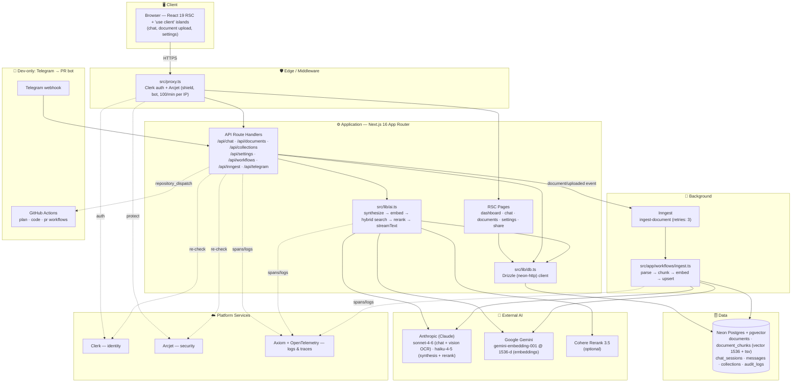
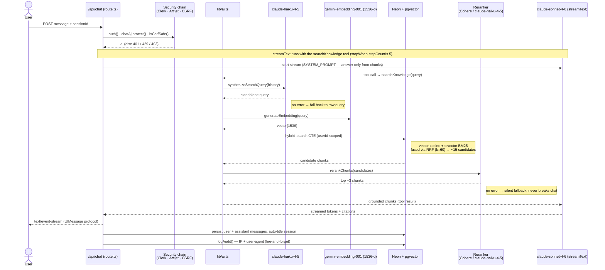
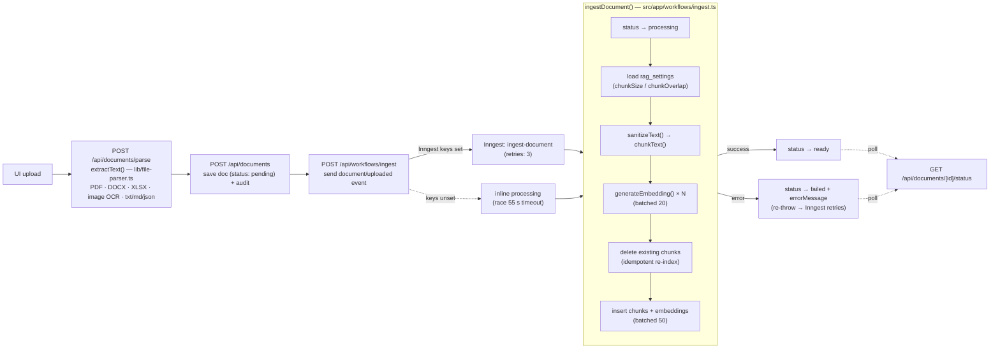

# System Architecture

> **Deep technical reference for the Company Knowledge Assistant.**
> This document holds the system **diagrams** (Mermaid topology + runtime flows), the **directory blueprint**, and **core-subsystem** deep dives.
> For the narrative architecture reference (schema tables, migration list, conventions, security model, evals), see **[`PROJECT_PLAN.md`](./PROJECT_PLAN.md)**. For setup and usage, see **[`Readme.md`](./Readme.md)**.

The app is a production-grade **RAG** (Retrieval-Augmented Generation) system: users upload documents, and the assistant answers questions grounded strictly in retrieved chunks, with citations. It runs on the 2026 Vercel stack — Next.js 16 (App Router / RSC), Vercel AI SDK v6, Anthropic (Claude) for all generation plus Google Gemini for embeddings, Neon Postgres + pgvector, Clerk, Arcjet, and Inngest.

---

## 1. System Topology

How the macro-components communicate. Every inbound request passes the Next.js middleware (`src/proxy.ts`) for Clerk auth + Arcjet before reaching the App Router; route handlers then re-check auth/Arcjet (and CSRF on mutations) before any logic runs.

---

## 2. Primary Runtime Workflow — a grounded chat turn

The core end-to-end cycle: an inbound chat message flows through the security chain, the RAG retrieval pipeline, the answer model, and back as a streamed, cited response — while history and an audit record are persisted. Implemented in `src/app/api/chat/route.ts` + `src/lib/ai.ts`.

**Graceful degradation is a design rule.** Query synthesis and reranking both fall back silently on error so the main chat flow never breaks — preserve this when editing `lib/ai.ts`.

---

## 3. Ingestion Workflow — upload to retrievable chunks

A second core cycle: turning an uploaded file into embedded, searchable chunks. Runs as an Inngest job (retries: 3) with an **inline fallback** (racing a 55 s timeout) when Inngest keys are unset. The UI polls `GET /api/documents/[id]/status` until `ready`.

---

## 4. Directory Blueprint

Architectural responsibility of every major directory.

| Path | Responsibility |
|---|---|
| `src/app/(auth)/` | Clerk-hosted `sign-in` / `sign-up` route group |
| `src/app/dashboard/` | Auth-gated app shell + overview (stat cards) |
| `src/app/dashboard/chat/[sessionId]/` | Per-session chat UI (list + thread, `loading`/`error` boundaries) |
| `src/app/dashboard/documents/[id]`, `/upload` | Document library (search/filter/sort), detail + chunk viewer, multi-file upload |
| `src/app/dashboard/settings/` | Tabbed: Profile · Knowledge Base (chunk settings) · Security/Activity (audit log) |
| `src/app/share/[shareId]/` | Public, read-only shared conversation |
| `src/app/workflows/ingest.ts` | The ingestion function (chunk → embed → upsert); called by the Inngest job |
| `src/app/api/**` | 14 route handlers (see [Core Subsystems](#5-core-subsystems) and `PROJECT_PLAN.md` API table) |
| `src/components/` | Feature components — `chat-*`, `document-*`, `collections-*`, `settings-*`, `dashboard-shell`, `sidebar-nav` |
| `src/components/ui/` | shadcn/ui primitives (button, dialog, tabs, toast, …) |
| `src/inngest/ingest-document.ts` | Inngest function wrapping `ingestDocument()` + status transitions |
| `src/lib/` | Cross-cutting libs — `ai`, `db`, `schema`, `env`, `arcjet`, `csrf`, `audit`, `inngest`, `file-parser`, `telegram-classifier`, `utils` |
| `src/lib/axiom/` | `axiom.ts` (client) · `server.ts` (`logger` + `withAxiom`) · `otel.ts` (OTLP tracer) |
| `src/hooks/` | Client React hooks |
| `src/proxy.ts` | **Next.js middleware** (named `proxy.ts`, not `middleware.ts`) — Clerk + Arcjet on all routes |
| `src/instrumentation.ts` | Boot hook: Zod env validation, OTel tracer registration, `onRequestError` |
| `evals/` | RAG eval harness mirroring production retrieval/answer logic + the Open RAG Benchmark suite |
| `drizzle/` | Generated + hand-written migration SQL (applied in order by `scripts/db-migrate.mjs`) |
| `scripts/` | `db-migrate.mjs` (apply migrations) · `db-baseline.mjs` (brownfield register-only) |
| `.github/workflows/`, `.github/scripts/` | Telegram → PR GitHub Actions (plan / code / pr / merge / main-pr) + their Neon↔Telegram glue scripts |
| `.agents/skills/` | Specialist skills (Next.js, Clerk, Neon) backing the Telegram → PR pipeline |

### API route folders (`src/app/api/`)

`chat` · `chat/sessions` · `chat/sessions/[id]` · `chat/sessions/[id]/share` · `collections` · `collections/[id]` · `documents` · `documents/[id]` · `documents/[id]/status` · `documents/parse` · `inngest` · `settings/rag` · `telegram/webhook` · `workflows/ingest` — full method/description table in `PROJECT_PLAN.md`.

---

## 5. Core Subsystems

### 5.1 RAG retrieval engine — `src/lib/ai.ts`

The single most important file. `createSearchKnowledgeTool` drives each query (see [§2](#2-primary-runtime-workflow--a-grounded-chat-turn)):

1. `synthesizeSearchQuery()` — claude-haiku-4-5 rewrites a follow-up into a standalone query using history (falls back to the raw query on error).
2. `generateEmbedding()` — embeds the synthesized query with Google gemini-embedding-001 (1536-d, `RETRIEVAL_QUERY` task type; chunks are embedded as `RETRIEVAL_DOCUMENT` at ingest).
3. **Hybrid search in one SQL CTE** — pgvector cosine (`vector_hits`) + Postgres `tsvector` BM25-style lexical (`bm25_hits` over the generated `content_tsv` column with a GIN index), fused via **Reciprocal Rank Fusion (k=60)** → ~15 candidates. See `drizzle/0005_hybrid_search.sql`.
4. `rerankChunks()` — Cohere Rerank 3.5 if `COHERE_API_KEY` is set, else a claude-haiku-4-5 scoring call; trims to top-N (default 3).
5. Chunks → claude-sonnet-4-6 via `streamText` with `searchKnowledge` as a tool (`stopWhen: stepCountIs(5)`, temperature 0.3).

The strict `SYSTEM_PROMPT` forbids the model from inventing numbers/dates/names not present in retrieved chunks — treat changes to it as behavior-affecting.

### 5.2 Ingestion subsystem — `src/inngest/ingest-document.ts` + `src/app/workflows/ingest.ts`

See [§3](#3-ingestion-workflow--upload-to-retrievable-chunks). `src/lib/file-parser.ts` `extractText()` handles PDF (pdf-parse), DOC/DOCX (mammoth), XLS/XLSX (xlsx), JPG/PNG (claude-sonnet-4-6 vision OCR), and text/md/json, with a 50 MB cap. Re-indexing reuses the same pipeline via the document re-index button. The Inngest function records `processing → ready|failed` and re-throws on error so Inngest retries.

### 5.3 Auth + security chain — `src/proxy.ts`, `lib/arcjet.ts`, `lib/csrf.ts`, `lib/audit.ts`

Every route honors two invariants (see [§6](#6-cross-cutting-invariants)). Arcjet clients are **per-surface** (`lib/arcjet.ts`): `chatAj` (20/min token bucket, keyed by userId), `uploadAj` (50/hr + 200/day), base `aj`; the middleware `aj` rate-limits by IP (100/min) before auth. Mutating POST routes also call `isCsrfSafe()` (`lib/csrf.ts`, Origin validation). `logAudit()` (`lib/audit.ts`) appends to `audit_logs` fire-and-forget with IP + user-agent.

### 5.4 Data layer — `src/lib/schema.ts`, `db.ts`, `drizzle/`

`collections` → `documents` → `document_chunks` (embedding `vector(1536)` + generated `content_tsv`); `chat_sessions` (denormalized `total_cost_usd`) → `chat_messages` (assistant turns carry `input_tokens`/`output_tokens`/`cost_usd`); `rag_settings`; `audit_logs`; `telegram_tasks`. `document_chunks.userId` is **denormalized** so retrieval scopes by tenant without a join. Per-query LLM cost is summed via a cost sink threaded through the retrieval pipeline, priced by `src/lib/pricing.ts`. `src/lib/db.ts` exposes a lazy `neon-http` Drizzle client behind a Proxy (`db.*` works anywhere). The pgvector `ivfflat` index and the `content_tsv` generated column + GIN index live in **raw SQL** migrations (`0000`, `0005`), not in `schema.ts`. Schema flow: edit `schema.ts` → `pnpm db:generate` → `pnpm db:migrate` (never `db:push`). Full table list + 7-migration manifest in `PROJECT_PLAN.md`.

### 5.5 Observability — `src/lib/axiom/`, `src/instrumentation.ts`

Logs, traces, and uncaught errors ship to **Axiom**; without `AXIOM_TOKEN` everything falls back to `console`. Wrap route handlers with `withAxiom` and emit structured events via `logger.info("event.name", {...})`. AI SDK spans (model, latency, tokens) export over OTLP from the tracer registered in `instrumentation.ts`. **Privacy default:** `recordInputs: false, recordOutputs: false` — prompts and completions are never sent off-server, only metadata/token counts/latency.

### 5.6 Telegram → PR bot (dev-only, optional)

`POST /api/telegram/webhook` verifies a shared secret + chat-id allowlist, classifies the message (`lib/telegram-classifier.ts`), and fires a `repository_dispatch` driving GitHub Actions (`telegram-plan` / `telegram-code` / `telegram-pr` / `telegram-merge` / `telegram-main-pr`), persisting progress in `telegram_tasks`. Actions can push task branches and open PRs into `dev` but never push to `main`/`dev`. The webhook returns `503` when its env vars are unset, so the rest of the app keeps working. Full state machine in `PROJECT_PLAN.md`.

---

## 6. Cross-cutting Invariants

Every route must honor both:

1. **Auth + security chain.** Middleware (`src/proxy.ts`) runs Clerk auth + Arcjet on all routes. API handlers then re-check `auth()` from `@clerk/nextjs/server` (401 if absent) and call the appropriate Arcjet client's `.protect()` again at the route level. Mutating POST routes also call `isCsrfSafe()`.
2. **Tenant isolation.** Every DB query is filtered by `userId`. `document_chunks.userId` is denormalized specifically so retrieval can scope by tenant without a join. Never write a query that could read across users.

---

> **Keep this current.** Per the Documentation Maintenance Rule in `CLAUDE.md`, when a change alters core data paths, system boundaries, API contracts, or dependencies, update the affected sections and Mermaid diagrams here (and in `Readme.md`).
